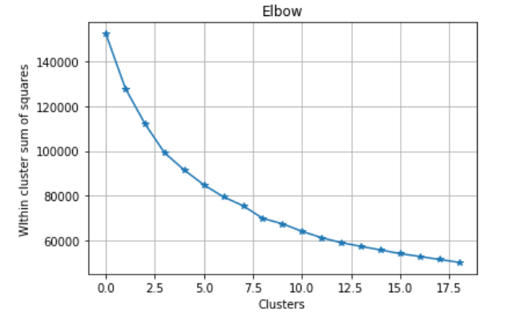
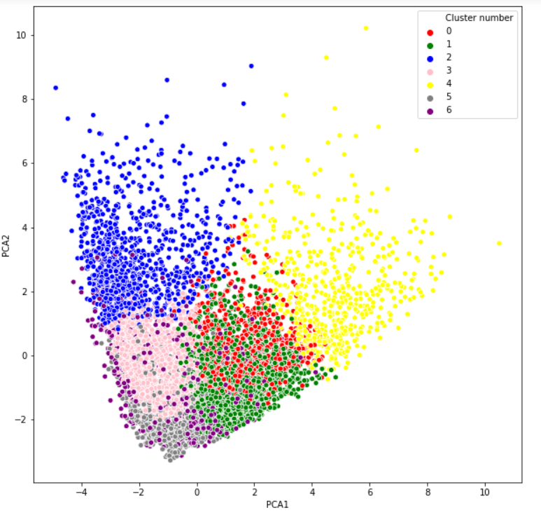
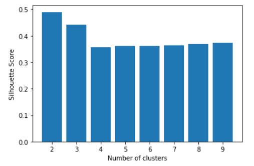
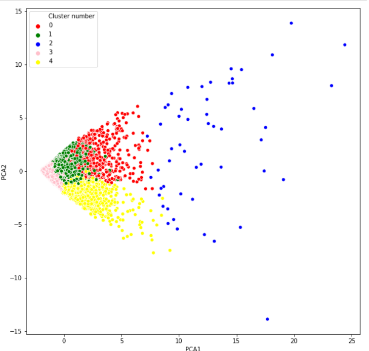

# Customer-Segmention-for-marketing
Marketing is crucial for the growth and sustainability of any business.
In order for marketers to launch a targeted marketing compaign,in this project we will cluster the customers into categories based on their behaviors
### Steps:
- 1 Data wrangling
- 2 Exploratory Data Analysis

- 3 Data visulation using Seaborn and matplotlib
- 4 Kmeans: has a linear time complexity O(n) as opposed to hierarchical which has a quadratic complexity - O(n^2)!,there was a time issue with Agglomerative Clustering compared to Kmeans
###### elbow method :
It is a heuristic method of interpretation and validation of consistency within cluster analysis designed to help find the appropriate number of clusters in a dataset by ploting within cluster sum of squares against number of clusters,the 'elbow' on the arm will be my best K (number of clusters)
KDE plots used for visualizing the probability density of different values in a continuous variable

- 5 Kmeans along with PCA 
###### PCA to perform dimentionality reducation as well as to do visualization

- 6 Agglomerative Clustering
###### Silhouette score

- 7 Autoencoders
work well with if there's correlations between input data 
for encoder and decoder we'll work with Sigmoid function as our activation function = (Weights x input +bias signal)
###### PCA after Autoencoders

